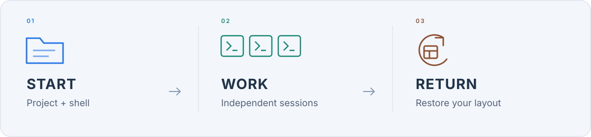

<p align="center">
  <picture>
    <source media="(max-width: 600px)" srcset="docs/readme/hero-en-compact.svg">
    
  </picture>
</p>

<p align="center"><strong>English</strong> / <a href="README.zh-CN.md">简体中文</a></p>
<p align="center"><strong>A terminal management workbench built for AI CLIs.</strong></p>

<p align="center">
  <a href="src/TerminalHub.App/TerminalHub.App.csproj"></a>
  <a href="src/TerminalHub.App"></a>
  <a href="scripts/run-linux.sh"></a>
  <a href="LICENSE"></a>
</p>

<p align="center">
  <a href="#quick-start">Get started</a> &nbsp; · &nbsp;
  <a href="https://github.com/coffe01-10/TerminalHub/releases">Downloads</a> &nbsp; · &nbsp;
  <a href="#themes">Themes</a> &nbsp; · &nbsp;
  <a href="#docs">Documentation</a>
</p>

While AI writes code, you still need to run the project, watch builds, execute tests, and take over the command line. Terminal Hub brings these terminal sessions into a native workbench, so you can organize work by project and find the task that needs your attention.

Claude Code, Codex CLI, and everyday shells run in their own sessions. Install and sign in to your AI CLIs separately; Terminal Hub hosts real shell processes and manages sessions. Authentication, model selection, and CLI permissions follow each tool's own settings.

## See Terminal Hub in action

https://github.com/user-attachments/assets/5c55badb-4a9a-4e93-874c-4f8be8a4e3d7

## Built around everyday AI CLI work

**One project, several kinds of work.** Keep AI conversations, development servers, builds, and tests in the same workspace. Each project retains its sessions and layout, while background processes keep running as you switch.

**See progress, then step in.** Live session previews and background output indicators help you notice what is happening. Switch, split, or open a terminal in its own window when needed; history and search help you find important output again.

**Treat terminal input as part of the experience.** IME input, cursor placement, multiline paste, text selection, and keyboard protocols all matter when working with AI CLIs. See [CLI interaction compatibility](docs/cli-compatibility.md) for the verified scope of individual tools.

**Keep repeatable work close.** Save common project commands, highlight important output, record terminal activity, or work with SSH sessions and remote files. Adjust fonts, themes, and shortcuts to suit your habits.

<p align="center">
  
</p>

<p align="center"><sub>A workflow illustration, independent of the application's page layout.</sub></p>

<a id="themes"></a>

## Find your theme

Dark Glass, Black, White, and Paper: four distinct palettes and textures.

<table>
  <tr>
    <td width="50%"><a href="docs/readme/theme-glass.svg"></a><p align="center"><strong>Dark Glass</strong></p></td>
    <td width="50%"><a href="docs/readme/theme-black.svg"></a><p align="center"><strong>Black</strong></p></td>
  </tr>
  <tr>
    <td width="50%"><a href="docs/readme/theme-white.svg"></a><p align="center"><strong>White</strong></p></td>
    <td width="50%"><a href="docs/readme/theme-paper.svg"></a><p align="center"><strong>Paper</strong></p></td>
  </tr>
</table>

<p align="center"><sub>SVG theme palette illustrations.</sub></p>

<a id="quick-start"></a>

## Get started

### Download a release

Visit [v0.4.0](https://github.com/coffe01-10/TerminalHub/releases/tag/v0.4.0) for the Windows portable package, Linux x64 archive, and plugin SDK. This release does not include a Windows installer. Release packages include the .NET runtime; see each release's notes for platform dependencies and changes.

### Run from source

Requires Git and the **.NET 8 SDK**. Windows uses ConPTY and needs Windows 10 1809 or newer; Linux uses a real PTY and needs a working X11 display.

**Windows**

```powershell
git clone https://github.com/coffe01-10/TerminalHub.git
cd TerminalHub
dotnet restore TerminalHub.sln
dotnet run --project src/TerminalHub.App
```

The default shell is PowerShell 7. If `pwsh` is unavailable, select Windows PowerShell or Command Prompt at startup.

**Linux (Debian / Ubuntu)**

```bash
sudo apt-get install libx11-6 libxcb1 libfontconfig1 libice6 libsm6 fonts-noto-cjk
git clone https://github.com/coffe01-10/TerminalHub.git
cd TerminalHub
bash scripts/run-linux.sh
```

Linux defaults to Bash on first launch. You can also select an installed PowerShell or a custom shell. See [Linux debugging notes](docs/local-debugging.md) for other environments.

### Start your first project

Enter your project directory and run your installed AI CLIs and project commands in separate sessions, for example:

```text
claude
codex
```

First run `echo Hello Terminal Hub` to check that your shell works, then arrange AI sessions, services, and tests around your work. Switching sessions preserves processes; closing a session ends its process. The next launch restores the workspace layout with fresh shell processes.

The app runs as a single instance. After rebuilding, exit the old instance normally before starting the new build.

## Everyday shortcuts

| Action | Default keys |
| --- | --- |
| New / close current session | `Ctrl+Shift+N` / `Ctrl+Shift+W` |
| Next / previous session | `Ctrl+Tab` / `Ctrl+Shift+Tab` |
| Copy selected text / interrupt a program | `Ctrl+Shift+C` / `Ctrl+C` |
| Paste | `Ctrl+V`, `Ctrl+Shift+V`, or `Shift+Insert` |
| Zoom in / out / reset font size | `Ctrl+=` / `Ctrl+-` / `Ctrl+0` |

Session-switching keys are configurable. Hold `Shift` for local selection and history scrolling when an application enables terminal mouse reporting.

<a id="docs"></a>

## Development and documentation

Built with **Avalonia 11 + .NET 8**, with separate layers for the native UI, terminal parsing, screen buffers, session management, and platform PTYs.

```powershell
dotnet build TerminalHub.sln -c Debug
dotnet test tests/TerminalHub.Tests/TerminalHub.Tests.csproj
```

- [Development guide](AGENTS.md): code entry points, known pitfalls, and relevant checks.
- [CLI interaction compatibility](docs/cli-compatibility.md): tools, protocols, and real CLI verification.
- [Workspace tools](docs/project-features-2026-10-02.md): usage details for tasks, output rules, broadcast, remote files, and recording.
- [Plugin development tutorial](docs/plugins/development-tutorial.en.md) ([中文](docs/plugins/development-tutorial.md)): build a complete Command Draft plugin from scratch, with a runnable sample, configuration, events and UI extensions.
- [Plugin guide and official plugins](docs/plugins/README.md): install Workspace Notes, Screen Clips and Command Watch; see the [SDK reference](docs/plugin-sdk.md) for API details.
- [Roadmap](docs/TODO.md): upcoming development.
- [README assets](docs/readme/README.md): SVG sources and generation.

Suggestions are welcome in [Issues](https://github.com/coffe01-10/TerminalHub/issues). For input or rendering problems, include your OS, shell / CLI version, and reproduction steps.

[MIT License](LICENSE) · Copyright © 2026 Jinhong Chen (coffe01-10)


## v0.4.0 workbench extensions

Adds nested splits, cross-workspace session moves, recent-session switching, Chinese/English UI, layout undo/redo and workspace tools in a reusable independent window. Native .NET/Avalonia plugins have a public SDK and independently built examples; see [plugin development](docs/plugin-sdk.md) and [delivery notes](docs/workbench-2026-10-03.md). The tools window and new modules have received a UI refinement; see [current UI and acceptance](docs/ui-refinement-2026-10-03.md). [v0.4.0 is available](https://github.com/coffe01-10/TerminalHub/releases/tag/v0.4.0).
