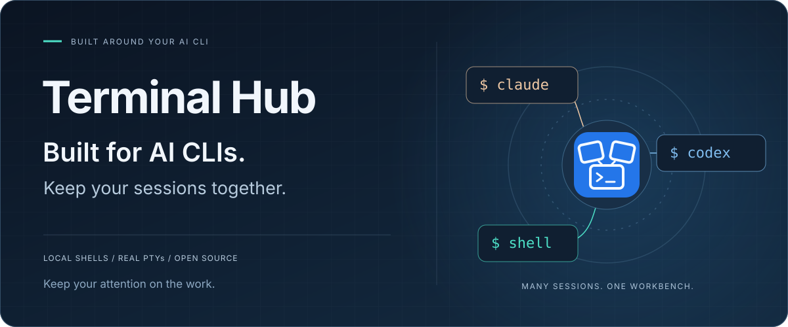
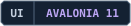
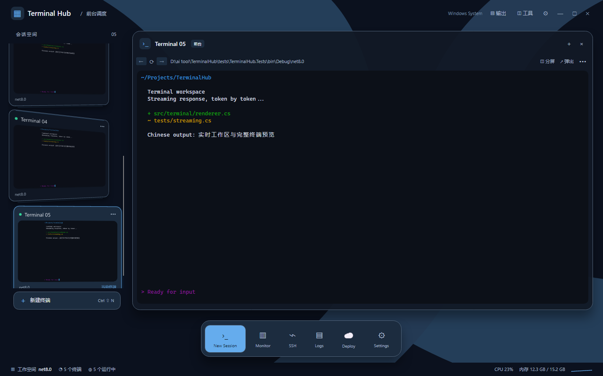
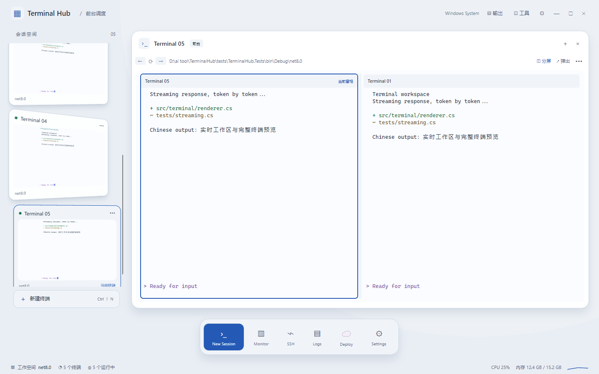
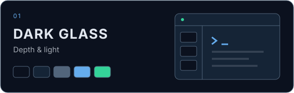
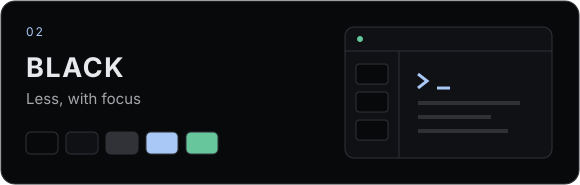
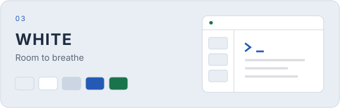
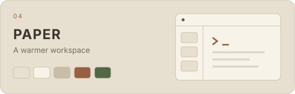
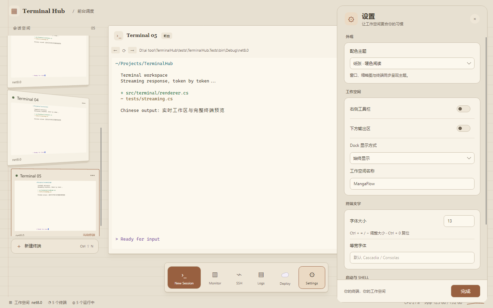

<p align="center">
  
</p>

<p align="center"><strong>English</strong> / <a href="README.zh-CN.md">简体中文</a></p>

<p align="center">
  <a href="src/TerminalHub.App/TerminalHub.App.csproj"></a>
  <a href="src/TerminalHub.App"></a>
  <a href="scripts/run-linux.sh"></a>
  <a href="LICENSE"></a>
</p>

<p align="center">
  <a href="#quick-start"><strong>Get started →</strong></a> &nbsp; · &nbsp;
  <a href="#the-workspace">Explore the workspace</a> &nbsp; · &nbsp;
  <a href="#themes">Find your theme</a> &nbsp; · &nbsp;
  <a href="#documentation-and-contributing">Documentation</a>
</p>

A dev server, a build, a spare shell. **Keep them in view.** Terminal Hub is a Windows-first native terminal that brings live session previews, split panes, and everyday tools into one workspace. Built with Avalonia and .NET, with real PTYs on Windows and Linux.

<a href="docs/readme/workspace.png"></a>

<p align="center"><sub>THE WORKSPACE · Dark Glass<br>Native Avalonia Headless render with a mock PTY and sample output. <a href="docs/readme/README.md">Image sources</a></sub></p>

<a id="the-workspace"></a>

## 01 / A place for every session

See what is happening before you switch. Bring a task forward when it needs your attention, then return it to the shelf without restarting its process.

<table>
  <tr>
    <td width="50%" valign="top">
      <h3>See it live</h3>
      <p>Real-time terminal thumbnails keep the whole workspace visible. Drag a card to reorder it; neighboring cards slide into place.</p>
    </td>
    <td width="50%" valign="top">
      <h3>Bring it forward</h3>
      <p>A Dock-inspired transition opens the selected session. Pop a session into its own window when it needs more room.</p>
    </td>
  </tr>
  <tr>
    <td width="50%" valign="top">
      <h3>Keep tools close</h3>
      <p>Files, logs, processes, SSH, and output panels are there when needed. The bottom dock can hide, stay visible, or disappear.</p>
    </td>
    <td width="50%" valign="top">
      <h3>Return to your layout</h3>
      <p>Remember session order, names, directories, shells, and split state. Restore the layout on the next launch with fresh shell processes.</p>
    </td>
  </tr>
</table>

### Two sessions. One clear focus.

Click **Split** to work side by side. Each pane has its own name and input target. Click a pane, then a thumbnail, to assign a session to it. Switching focus keeps the main surface still; the shelf follows your selection.

<a href="docs/readme/split.png"></a>

<p align="center"><sub>SIDE BY SIDE · White<br>Independent sessions, a labeled pane for each, and a visible focus indicator.</sub></p>

<a id="themes"></a>

## 02 / Make the workspace yours

Four palettes, carried through the terminal, shelf, menus, and settings. Glass gets reflected highlights; black gets fine outlines; white gets soft shadows; paper gets layered edges.

<table>
  <tr>
    <td width="50%"><a href="docs/readme/workspace.png"></a><p align="center"><strong>Dark Glass</strong></p></td>
    <td width="50%"><a href="docs/readme/black.png"></a><p align="center"><strong>Black</strong></p></td>
  </tr>
  <tr>
    <td width="50%"><a href="docs/readme/split.png"></a><p align="center"><strong>White</strong></p></td>
    <td width="50%"><a href="docs/readme/settings.png"></a><p align="center"><strong>Paper</strong></p></td>
  </tr>
</table>

<p align="center"><sub>Palette studies · Click a theme to see its native render.</sub></p>

Choose your monospace font, adjust its size, and decide which panels stay in view. Grouped settings keep appearance and workspace controls together.

<details>
<summary><strong>Inside Settings</strong> — open the Paper theme preview</summary>



</details>

### Familiar keys. Real shells.

Drag to select, `Ctrl+Shift+C` to copy, and `Ctrl+C` to interrupt. Chinese IME positioning, history scrolling, text search, and multi-line paste are supported. Hold `Shift` to use local selection and scrolling when an app enables mouse reporting.

Claude Code, Codex CLI, and other tools install and run inside your shell. See [CLI interaction compatibility](docs/cli-compatibility.md) for the protocols and scenarios already verified.

<a id="quick-start"></a>

## 03 / From source to your first session

<p align="center">
  
</p>

> **v0.3.1.** [Download the Windows installer or portable ZIP](https://github.com/coffe01-10/TerminalHub/releases/tag/v0.3.1) or start from source below. The app is unsigned. Windows is the primary platform, Linux sees less daily verification, and macOS is not a verified target. See the [release notes](docs/releases/v0.3.1.md).

Linux x64: [download v0.3.2](https://github.com/coffe01-10/TerminalHub/releases/tag/v0.3.2) and extract `TerminalHub-linux-x64.tar.gz`. The .NET runtime is included; see the [Linux release notes](docs/releases/v0.3.2.md) for system dependencies and verification limits.

Settings now offers a live appearance preview and configurable session shortcuts. Record a key combination in the Shortcuts tab and save it. Defaults: `Alt+1…9` selects a terminal in shelf order; `Ctrl+Tab` / `Ctrl+Shift+Tab` cycles sessions. These shortcuts work inside the main window.

### Portable Windows preview

Run `pwsh -File scripts/publish-windows.ps1 -SkipInstaller` to generate `artifacts/TerminalHub-windows-x64-preview.zip`. Extract the entire folder and launch `TerminalHub.exe`; no .NET SDK is needed. The archive includes a quick-start guide and license. If the default shell is missing, the app offers installed shells directly.

Session cards show unread background output and the terminal process's exit code. Viewing a session clears its unread indicator; both visible split panes count as viewed.

### Windows

Requires **Windows 10 1809 or later / Windows 11**, Git, and the **.NET 8 SDK**. The default shell is PowerShell 7, so make sure `pwsh` is on PATH.

```powershell
git clone https://github.com/coffe01-10/TerminalHub.git
cd TerminalHub
dotnet restore TerminalHub.sln
dotnet run --project src/TerminalHub.App
```

Without `pwsh`, select Windows PowerShell or Command Prompt at startup and click "开始使用". WSL, custom shells, and SSH connections require the corresponding programs locally; WSL also needs a configured distribution.

### Linux

Requires the **.NET 8 SDK**, Git, a working X11 display, and font dependencies. On Debian / Ubuntu:

```bash
sudo apt-get install libx11-6 libxcb1 libfontconfig1 libice6 libsm6 fonts-noto-cjk
git clone https://github.com/coffe01-10/TerminalHub.git
cd TerminalHub
bash scripts/run-linux.sh
```

New sessions also default to `pwsh`; with only Bash installed, choose Bash at startup. On a machine without a physical display, install Xvfb and run `bash scripts/run-linux.sh --headless`.

### First run

1. Click into a terminal and run `echo Hello Terminal Hub`; the output should appear in both the terminal and its thumbnail.
2. Press `Ctrl+Shift+N` for a new session and click thumbnails to switch; processes in the original session keep running.
3. Click **Split** and try typing on each side; the pane name and highlighted border show which session receives input.

Restoring a workspace starts fresh processes; running programs and their progress are not restored. The app runs as a single instance. After rebuilding, exit the old instance normally before starting the new build.

<a id="keyboard-shortcuts"></a>

## 04 / Keep your hands on the keys

| Action | Shortcut |
| --- | --- |
| New / close current session | `Ctrl+Shift+N` / `Ctrl+Shift+W` |
| Next / previous session | `Ctrl+Tab` / `Ctrl+Shift+Tab` |
| Toggle toolbar / output area | `Ctrl+Shift+B` / `Ctrl+Shift+J` |
| Copy selected text | `Ctrl+Shift+C` |
| Paste | `Ctrl+V`, `Ctrl+Shift+V`, or `Shift+Insert` |
| Zoom in / out / reset font size | `Ctrl+=` / `Ctrl+-` / `Ctrl+0` |
| Rename a session | `F2` with the session list focused, or double-click its title |

When the terminal has focus, `F2` goes to the program inside it. Closing a session ends its process.

<details>
<summary>Where are settings stored?</summary>

| Platform | Default settings file |
| --- | --- |
| Windows | `%APPDATA%\TerminalHub\settings.json` |
| Linux | `${XDG_CONFIG_HOME:-~/.config}/terminalhub/settings.json` |

Settings and workspace layout stay on the local machine. Changing the shell in Settings affects terminals created afterwards; existing sessions keep their original processes.

</details>

<a id="development-and-checks"></a>

## 05 / Keep building

The project is **Avalonia 11 + .NET 8**. Windows sessions run on ConPTY, Linux on `forkpty`; VT parsing, the screen buffer, and session management live in a standalone core project.

```text
src/
├── TerminalHub.App     Native UI, terminal rendering, IME, and workspace
├── TerminalHub.Core    VT parsing, screen buffer, sessions, and settings
└── TerminalHub.Pty     Windows ConPTY, Linux PTY, and mock PTY
tests/
└── TerminalHub.Tests   Core logic, native layout, and interaction regressions
```

```powershell
dotnet build TerminalHub.sln -c Debug
dotnet test tests/TerminalHub.Tests/TerminalHub.Tests.csproj
```

<details>
<summary>Build a distributable package</summary>

The Windows x64 publish script needs PowerShell 7. Produce the app with the .NET runtime included:

```powershell
pwsh -File scripts/publish-windows.ps1 -SkipInstaller
```

Output goes to `artifacts/publish/win-x64/`. With Inno Setup 6 installed, drop `-SkipInstaller` to also build the installer under `artifacts/installer/`. The installer closes a running Terminal Hub — save your work and exit normally first.

Linux x64:

```bash
bash scripts/publish-linux.sh
```

Output goes to `artifacts/publish/linux-x64/` and `artifacts/TerminalHub-linux-x64.tar.gz`. Self-contained builds carry the .NET runtime, but Linux still needs the corresponding graphics system libraries. A release version can be passed as an MSBuild option, for example `bash scripts/publish-linux.sh -p:Version=0.3.2`.

</details>

<a id="documentation-and-contributing"></a>

### Explore the project and contribute

- [Development guide](AGENTS.md): code entry points, background on known issues, and how to verify changes (Chinese).
- [CLI interaction compatibility](docs/cli-compatibility.md): paste, mouse, shortcuts, and the verified scope.
- [Linux debugging notes](docs/local-debugging.md): X11, Xvfb, and local debugging; historical UI descriptions defer to current source.
- [Product notes](docs/PRODUCT.md): design background and requirements history.
- [Product roadmap](docs/TODO.md): planned features and iteration checklist (Chinese).

Issues and improvement suggestions are welcome at [GitHub Issues](https://github.com/coffe01-10/TerminalHub/issues). For display or input problems, include your OS, shell / CLI version, reproduction steps, and a screenshot; when contributing a fix, add or run the regressions that cover the specific behavior.

Current focus areas are Unicode graphemes and cell widths, cursor and IME positioning, and multi-session performance.

---

<p align="center">
  
</p>
<p align="center"><strong>A place for your terminals. Space for your work.</strong></p>
<p align="center"><a href="#quick-start">Get started</a> · <a href="https://github.com/coffe01-10/TerminalHub/issues">Report an issue</a> · <a href="LICENSE">MIT License</a></p>
<p align="center"><sub>Copyright © 2026 Jinhong Chen (coffe01-10)</sub></p>
