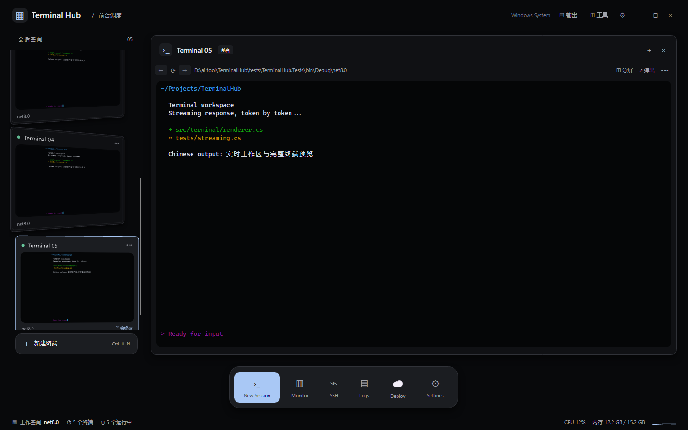

<p align="center">
  
</p>
<p align="center">
  <a href="README.md">English</a> · <strong>简体中文</strong>
</p>
<p align="center">
  <a href="src/TerminalHub.App/TerminalHub.App.csproj"></a>
  <a href="src/TerminalHub.App"></a>
  <a href="scripts/run-linux.sh"></a>
  <a href="LICENSE"></a>
</p>
<p align="center"><strong>多个终端，一个工作空间。</strong></p>
<p align="center">
  
</p>

Terminal Hub 是一款 **Windows 优先、支持 Linux 的原生多会话终端**，面向同时使用多个项目、开发服务和命令行工具的开发者。实时缩略图帮你找到会话，分屏让两个任务并排工作，文件、日志和进程工具随时可以展开。

[界面与操作](#workspace) · [快速开始](#quick-start) · [常用快捷键](#shortcuts) · [参与开发](#development) · [文档](#docs)

> [!NOTE]
> Terminal Hub 正在活跃开发中，目前还没有提供签名的发布版本——从源码构建运行是现阶段的使用方式。Windows 是首要平台；Linux 使用真实 PTY 但日常验证较少，macOS 尚不是已验证平台。恢复工作区会重新启动 Shell 进程：布局会回来，上次运行的程序及其进度不会。


<p align="center"><sub>本页界面图由当前源码通过 Avalonia Headless + Skia 渲染，使用 Mock PTY 与示例终端输出，不是真实 CLI 会话的录屏。<a href="docs/readme/README.md">素材来源与更新方式</a></sub></p>

## 让每个会话都有位置

开发服务正在运行，另一边需要查看日志，还要留一个 Shell 执行临时命令。Terminal Hub 把这些会话放在同一工作空间里，让你切换之前就能看到它们的内容。

| 日常操作 | Terminal Hub 的处理方式 |
| --- | --- |
| 找到正在运行的任务 | 左侧缩略图展示实时终端内容；点击切换，拖动调整顺序 |
| 同时操作两个会话 | 左右分屏，各自显示名称；点击窗格立即切换输入焦点 |
| 临时放大一个任务 | 从缩略图展开到主区域，或将会话弹出为独立窗口 |
| 查看命令背后的信息 | 按需展开文件、日志、进程、SSH 和输出面板 |
| 调整自己的工作环境 | 四种主题、等宽字体与字号设置，以及三种 Dock 显示模式 |
| 回到熟悉的布局 | 保存会话顺序、名称、目录、Shell、分屏与活动会话 |

工作区恢复会重新启动 Shell 进程；上次运行的程序及其进度不会随布局一起恢复。

<a id="workspace"></a>

## 界面与操作

### 会话在左，工作在前

缩略图拖动时跟随指针，相邻卡片平滑让位，松手后落入新位置。切换会话采用受 macOS Dock 启发的展开过渡；缩略图仅预览内容，动画不会为了自身尺寸调整终端的 PTY 网格。

点击工具栏的 **「分屏」**，把两个会话并排放置。先点击要操作的窗格，再点左侧缩略图，可为该窗格换一个会话。左右窗格切换时主区域保持静止，侧栏更新活动状态。


### 四种主题，一套工作习惯

**深蓝玻璃、深黑、亮白、纸张**覆盖主窗口、终端、缩略图、菜单和设置。未展开的卡片使用各自的主题细节：玻璃高光、深黑细描边、亮白柔和阴影和纸张叠页。

设置采用分组布局，可调整主题、工具栏、输出区、Dock、字体与新终端使用的 Shell。Dock 默认靠近底部时显示，也可改为始终显示或隐藏。


<details>
<summary>查看深黑主题</summary>



</details>

### 保留终端里的操作习惯

鼠标拖选后使用 `Ctrl+Shift+C` 复制，`Ctrl+C` 保留给运行中的程序。支持中文输入法定位、历史滚动、文本搜索和多行粘贴。应用启用终端鼠标协议时，按住 `Shift` 可使用终端自身的选择与滚动。

Claude Code、Codex CLI 等工具可在 Shell 内单独安装和运行。具体键盘协议、鼠标行为及已经验证的范围，见 [CLI 交互适配](docs/cli-compatibility.md)。

<a id="quick-start"></a>

## 快速开始

### Windows

需要 **Windows 10 1809 或更高版本 / Windows 11**、Git 和 **.NET 8 SDK**。默认启动 Shell 为 PowerShell 7，请确保 `pwsh` 在 PATH 中。

```powershell
git clone https://github.com/coffe01-10/TerminalHub.git
cd TerminalHub
dotnet restore TerminalHub.sln
dotnet run --project src/TerminalHub.App
```

没有安装 `pwsh` 时，可打开设置，把「新终端使用」改为 `cmd.exe`，再点击「新建终端」。WSL、自定义 Shell 和 SSH 连接需要相应程序已在本机安装。

### Linux

需要 **.NET 8 SDK**、Git、可用的 X11 显示环境及字体依赖。Debian / Ubuntu 上的界面依赖可以用以下命令安装：

```bash
sudo apt-get install libx11-6 libxcb1 libfontconfig1 libice6 libsm6 fonts-noto-cjk
git clone https://github.com/coffe01-10/TerminalHub.git
cd TerminalHub
bash scripts/run-linux.sh
```

默认会话同样使用 `pwsh`；若只安装了 Bash，打开设置选择 `bash`，再新建终端。无实体显示器时，安装 Xvfb 后可运行 `bash scripts/run-linux.sh --headless`。

### 第一次使用

1. 点击一个终端，在提示符后执行 `echo Hello Terminal Hub`，应在当前终端及其缩略图中看到输出。
2. 使用 `Ctrl+Shift+N` 新建会话，点击缩略图切换；原会话中的进程继续运行。
3. 点击「分屏」，尝试在两侧分别输入；通过窗格名称与高亮边框确认当前会话。

应用采用单实例运行。重新编译后，请先正常退出旧实例，再启动新版本。

<a id="shortcuts"></a>

## 常用快捷键

| 操作 | 快捷键 |
| --- | --- |
| 新建 / 关闭当前会话 | `Ctrl+Shift+N` / `Ctrl+Shift+W` |
| 下一个 / 上一个会话 | `Ctrl+Tab` / `Ctrl+Shift+Tab` |
| 显示或隐藏工具栏 / 输出区 | `Ctrl+Shift+B` / `Ctrl+Shift+J` |
| 复制选中文字 | `Ctrl+Shift+C` |
| 粘贴 | `Ctrl+V`、`Ctrl+Shift+V` 或 `Shift+Insert` |
| 放大 / 缩小 / 重置字号 | `Ctrl+=` / `Ctrl+-` / `Ctrl+0` |
| 重命名会话 | 会话列表聚焦时按 `F2`，或双击会话标题 |

终端聚焦时，`F2` 交给终端内的程序。关闭会话会结束其进程。

<details>
<summary>配置保存在哪里？</summary>

| 平台 | 默认配置文件 |
| --- | --- |
| Windows | `%APPDATA%\TerminalHub\settings.json` |
| Linux | `${XDG_CONFIG_HOME:-~/.config}/terminalhub/settings.json` |

设置和工作区布局保存在本机。界面中修改 Shell 会影响之后新建的终端；已有会话继续使用原来的进程。

</details>

<a id="development"></a>

## 开发与打包

项目采用 **Avalonia 11 + .NET 8**。Windows 使用 ConPTY，Linux 使用 `forkpty`；终端解析、屏幕缓冲和会话管理位于独立的 Core 项目。

```text
src/
├── TerminalHub.App     原生界面、终端绘制、输入法与工作区
├── TerminalHub.Core    VT 解析、屏幕缓冲、会话与设置
└── TerminalHub.Pty     Windows ConPTY、Linux PTY、Mock PTY
tests/
└── TerminalHub.Tests   核心逻辑、原生布局与交互回归
```

```powershell
dotnet build TerminalHub.sln -c Debug
dotnet test tests/TerminalHub.Tests/TerminalHub.Tests.csproj
```

<details>
<summary>生成可分发版本</summary>

Windows x64 发布脚本需要 PowerShell 7。先生成包含 .NET 运行时的应用：

```powershell
pwsh -File scripts/publish-windows.ps1 -SkipInstaller
```

输出目录为 `artifacts/publish/win-x64/`。安装 Inno Setup 6 后，去掉 `-SkipInstaller` 即可同时生成安装程序，输出到 `artifacts/installer/`。安装程序会结束正在运行的 Terminal Hub，使用前请先保存工作并正常退出。

Linux x64：

```bash
bash scripts/publish-linux.sh
```

输出目录为 `artifacts/publish/linux-x64/`。自包含发布携带 .NET 运行时，Linux 上仍需要相应的图形系统库。

</details>

<a id="docs"></a>

## 文档与贡献

- [开发指引](AGENTS.md)：代码入口、已知问题背景与验证方式。
- [CLI 交互适配](docs/cli-compatibility.md)：粘贴、鼠标、快捷键和兼容性验证范围。
- [Linux 调试记录](docs/local-debugging.md)：X11、Xvfb 与本机调试；历史界面描述以当前源码为准。
- [产品说明](docs/PRODUCT.md)：设计背景与需求记录。

欢迎通过 [Issues](https://github.com/coffe01-10/TerminalHub/issues) 提交问题或改进建议。终端显示与输入问题请附上系统、Shell / CLI 版本、复现步骤和截图；贡献代码时请为修复的具体行为补充或运行相关回归。

当前开发重点包括 Unicode 字素与格宽、光标与输入法定位，以及多会话性能。

## 许可证

[MIT](LICENSE) · Copyright © 2026 Jinhong Chen (coffe01-10)
